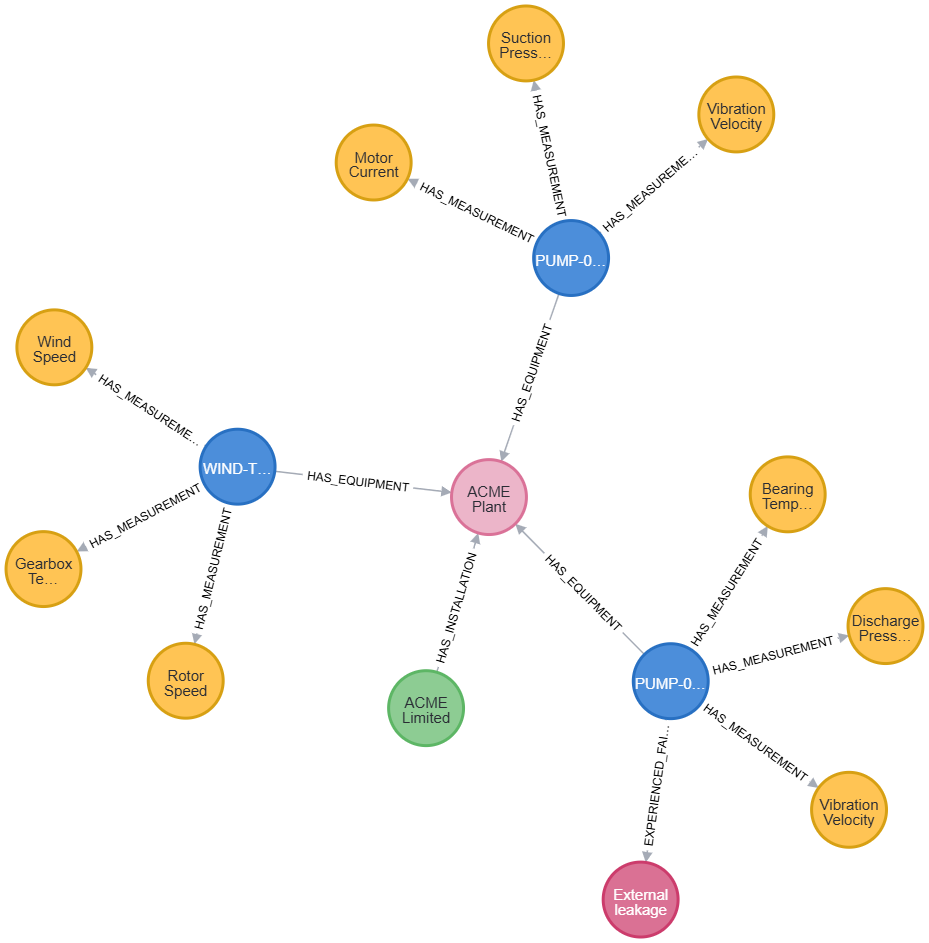
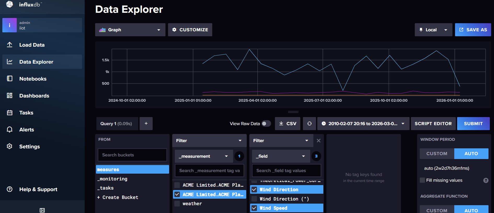

[](https://venergiac.substack.com/)

# Project

How to use Graph-RAG with Industrial Dataset.


see docker-compose.yaml

## Data

* data/acme-plant.json - data ISO 14224:2016 of a small plant (generated by AI)

## Code
* src/iso2neo4j.py - file to import data into neo4j database using GQL
* src/graphrag-app.py - file for the app
* src/start.ipynb - app to start application

# How To

## Start Services
:whale: start all the containers with

    docker compose up

now you can connect to NEO4J
* connect to neo4j [http://localhost:7474/browser/](http://localhost:7474/browser/) with username / passowrd = neo4j / password

open datascience [http://localhost:8888/notebooks/work/src/start.ipynb](http://localhost:8888/notebooks/work/src/start.ipynb) (password is 'password') and import data

```
from iso2neo4j import PlantDataImporter
importer = PlantDataImporter("neo4j://neo4j","neo4j","password")
importer.clean_all_data()
importer.import_plant_data("../data/acme-plant.json")
```
then on NEO4J run the following command to see the graph
```
MATCH(n) RETURN n
```

and you will get the following graph 



## Import data into InfluxDb and Sync with Neo4J
Now for each equipmente we import data into influxdb (I used 2 for simiplicity).

Get all Equipments from NEO4J
```
import neo4j

equipments = importer.driver.execute_query(
    "MATCH (c:Company)-[:HAS_INSTALLATION]->(i:Installation)-[:HAS_EQUIPMENT]->(e:Equipment) RETURN c.id +'.'+ i.id + '.' + e.id AS EQUIPMENT",
    database_="neo4j",
    result_transformer_=neo4j.Result.to_df
)
```

then import all file into InfluxDB

```
from csv2influxdb import EquipmentCsvInfluxImporter
data_importer = EquipmentCsvInfluxImporter("http://influxdb:8086", "MyInitialAdminToken0==", "iiot", "measures", "../data")
data_importer.import_all(equipments['EQUIPMENT'].values)
```

You can test your data on InfluxDB accessing to [http://localhost:8086/](http://localhost:8086/) with username / password = admin / password.

Below the expected results:



## Finnaly Test Graph Rag
To test GraphRag we need to pull mistral model; please connect to docker and pull mistral model.


:whale: from command console
```
docker compose exec ollama ollama pull mistral:7b-instruct
```

:point_right:: Now test the model with the following code:

```
from graphrag_app import OllamaGraphRAG
app = OllamaGraphRAG("neo4j://neo4j","neo4j","password")
app.chat_with_rag("Which events occurred at Equipment PUMP-001?")
```

The output 

```
Generated Cypher:

MATCH (c:Company)-[:HAS_INSTALLATION]->(i:Installation)<-[:HAS_EQUIPMENT]- (e:Equipment {id: 'PUMP-001'})-[:EXPERIENCED_FAILURE]->(f:FailureEvent)
RETURN f

Full Context:
[{'f': {'mode': 'External leakage', 'impact': 'Critical', 'id': 'FAIL-P001-01', 'mechanism': 'Wear', 'down_time_hrs': 14.0}}]

> Finished chain.
' A critical event of external leakage occurred at Equipment PUMP-001, with a duration of 14 hours. The mode of the event is wear.'
```

:point_right: More tests:

```
app.chat_with_rag("What is the Vibration Velocity of Equipment PUMP-001?")
```

The output 

```
Generated Cypher:

MATCH (equipment:Equipment {id: 'PUMP-001'})-[:HAS_MEASUREMENT]->(measurement)
WHERE measurement.name = 'Vibration Velocity'
RETURN measurement.value

Full Context:
[{'measurement.value': 4.2}]

> Finished chain.
' The vibration velocity of Equipment PUMP-001 is 4.2.'
```

## Credits
* [awesome-industrial-datasets](https://github.com/jonathanwvd/awesome-industrial-datasets)